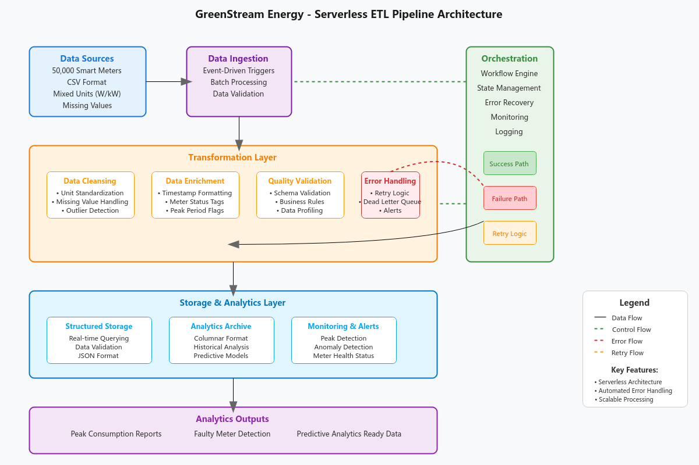

**Smart Energy Meter ETL Pipeline**

This project implements a complete ETL (Extract–Transform–Load) pipeline for processing smart-meter electricity consumption data.
The pipeline ensures data quality, standardization, validation, and structured storage to support reliable analytics and reporting.

📌 Project Overview

The system processes raw smart-meter readings uploaded as CSV files.
It performs cleaning, validation, transformation, and structured storage while handling both successful and failed records robustly.

Key objectives of the project:

Ensure data consistency and accuracy

Detect faulty or unreliable meter data

Maintain both raw and clean processed datasets

Prepare data for analytics, dashboards, and forecasting

🧩 ETL Architecture Diagram

Below is the architecture diagram illustrating the full workflow of the ETL system:

⚙️ Transformation & Business Rules

During the Transform phase, several business rules are applied:

✅ Rule 1 — Unit Standardization

Convert Watts → Kilowatts

If unknown unit → mark record invalid

✅ Rule 2 — Missing Values Handling

NULL readings are flagged and excluded from peak-usage calculations

✅ Rule 3 — Timestamp Validation

Missing timestamps → invalid

Duplicate timestamps per meter → invalid

✅ Rule 4 — Data Range Validation

Negative values → invalid

Extremely large suspicious values → anomaly flagged

✅ Rule 5 — Faulty Meter Detection

Continuous zero or near-zero readings → potential faulty meter

✅ Rule 6 — Schema Validation

Required fields:

meter_id

timestamp

energy_value

energy_unit

Missing required fields → failure path

🔄 Single Record Lifecycle

1️⃣ Upload to Raw Storage
Data is ingested and stored in raw form for traceability

2️⃣ ETL Trigger
New file arrival triggers pipeline execution

3️⃣ Cleaning & Validation
Business rules are applied

4️⃣ Structured Storage (RDS)
Valid records stored in relational database

5️⃣ Archival as Parquet
Optimized for analytics & ML workloads

6️⃣ Success / Failure Handling

Success → stored + archived + logged

Failure → routed to failed storage with retries & logging

🛠 Technologies / Concepts Demonstrated

ETL Architecture Design

Data Cleaning & Standardization

Data Quality Validation

Error Handling & Logging

Structured & Analytical Storage Strategies

📬 Contact

Developed by:
Amany Elfiky
📧 amanyelfiky2020@gmail.com
