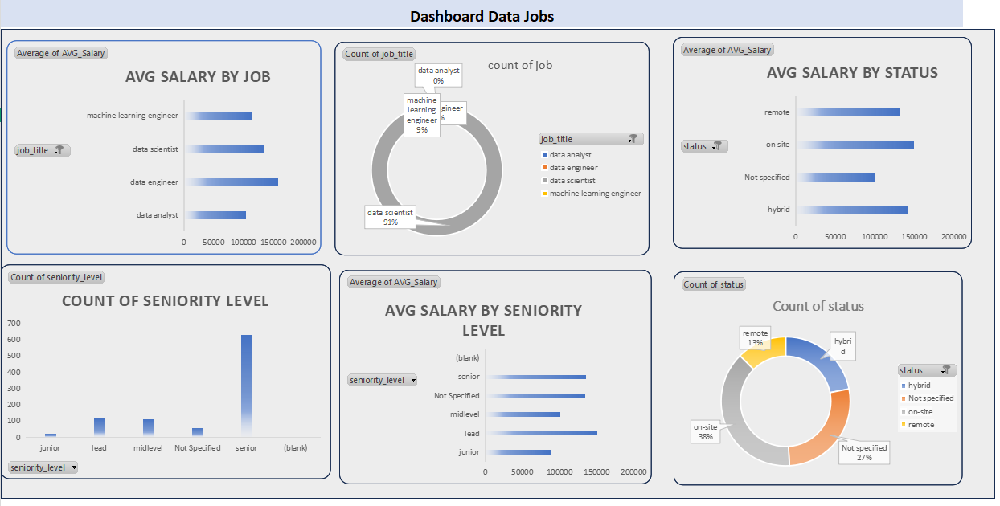
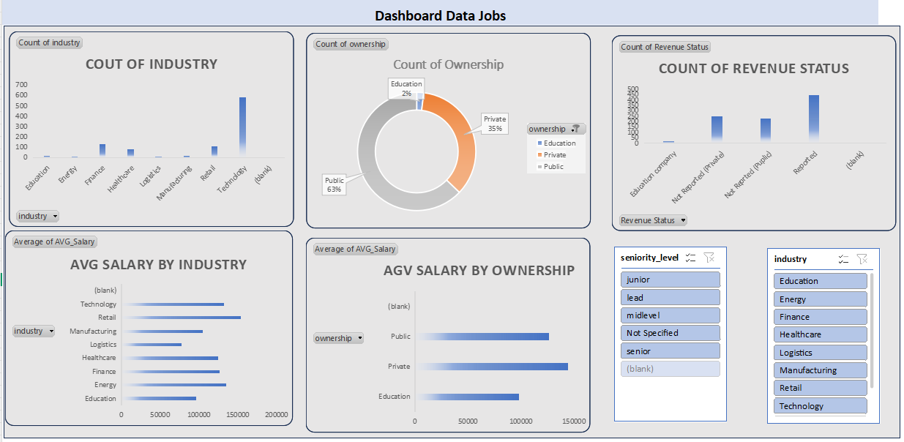

# 💼 Data Science Jobs Analysis: From Raw Data to Insightful Dashboard

---

## 🔍 Dataset Overview

The project utilized a dataset containing various attributes for global Data Science job postings.

| Feature | Description | Initial Status (Raw Data) |
| :--- | :--- | :--- |
| `post_date` | Date of the job posting. | Needs standardization. |
| `headquarter` | Location of the company headquarters. | Clean. |
| `industry` | Company industry (e.g., Technology, Finance). | Clean. |
| `ownership` | Company ownership (e.g., Public, Private). | Have Missing. |
| `revenue` | Company revenue and status. | **Highly unstructured (Mixed text and numerical values with currency symbols and status).** |
| `Salary` | salary for the job. | **Contained ranges (e.g., 150-170K).** |

---

## 🛠️ Data Pre-processing and Transformation Steps

The core of this project focused on extensive data cleaning and feature engineering to prepare the raw data for accurate analysis.

### 1. Handling Missing Values (Nulls) 🗑️
* **Action:** Missing values (Nulls) across all critical columns were systematically  imputed (depending on the column) to ensure the integrity of the statistical calculations.

### 2. Deconstructing the `revenue` Column (Feature Engineering) 🧩
The single, messy `revenue` column was strategically split into two new, clean features:

| New Feature | Purpose | Key Actions |
| :--- | :--- | :--- |
| **`Revenue_numeric`** | The standardized financial value of the revenue. | Cleaned the column by **removing currency symbols** (€, $), converting abbreviations (M, B, T) into full numerical values, and standardizing the data type. |
| **`Revenue Status`** | The reporting status of the company's revenue. | Extracted status details like **'Reported'**, **'Not Reported (Public)'**, and **'Not Defined'** from the original mixed column to create a clean categorical variable. |

### 3. Calculating `AVG_Salary` from Ranges 💰
The original `Salary` column contained salary ranges (e.g., 150705). This required transformation to calculate a meaningful average.

* **Action:** The minimum and maximum values of the salary range were extracted, and a new, single **Average Salary** column was computed. This standardized numerical column is crucial for all subsequent visualizations and comparisons.

---

## 📈 Dashboard and Key Insights

### 1. Dashboard Focus (General Metrics)
The first dashboard focused on internal job metrics like compensation, location, and job type.

* **Key Insights Uncovered:**
    * **Job Titles:** Comparison of `AVG_Salary` across roles like Data Analyst, Data Scientist, and Machine Learning Engineer.
    * **Job Status:** Salary comparison between **Remote**, **On-site**, and **Hybrid** positions.
    * **Seniority:** Count of job postings by **Junior, Midlevel, and Senior** roles.

---
### 2. Dashboard Focus (Company Metrics)
The second dashboard segment linked salaries to the company's profile.

* **Key Insights Uncovered:**
    * **Industry Impact:** Comparing the average salary across different **Industries** (e.g., Technology vs. Finance).
    * **Ownership Type:** Visualizing the salary difference between **Public** and **Private** companies.
    * **Revenue Status:** Analyzing the distribution of job postings based on the **Revenue Status** of the company.
 
      

---

## 🤝 Conclusion

This project successfully demonstrated end-to-end proficiency in data cleaning (handling nulls, complex extraction) and feature engineering (splitting messy columns) in Excel, concluding with clear, actionable insights through a comprehensive dashboard.

## 💬 Author
**Amany Elfiky**  
Data Analyst | Data Scientist

📧 amanyelfiky2020@gmail.com  
