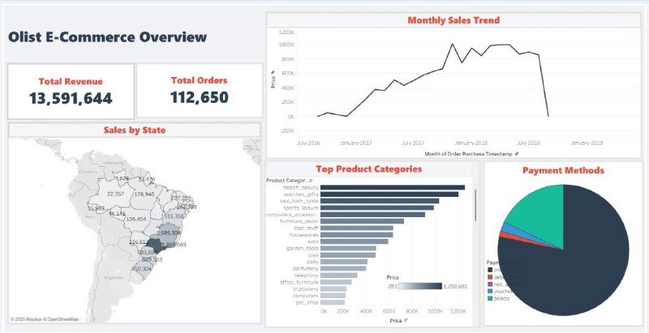
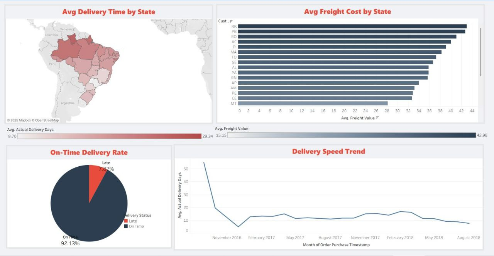
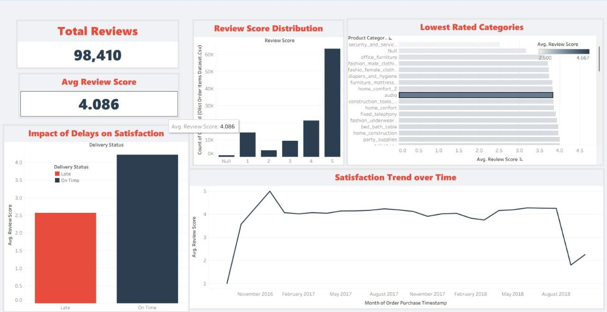

# Brazilian E-Commerce Public Dataset by Olist

## 🔍 Dataset Overview

The project utilized the **Brazilian E-Commerce Public Dataset by Olist**, covering 100k orders made at multiple marketplaces in Brazil. The analysis is structured into three distinct dashboards covering Sales, Logistics, and Customer Satisfaction.

## 🛠️ Data Pre-processing (Tableau)

The core of this project focused on utilizing **Tableau's Calculated Fields** to derive meaningful metrics.

* **Logistics Measures:** Created logic to flag orders as `On Time` or `Late` by comparing `order_delivered_customer_date` vs. `order_estimated_delivery_date`.
* **Processing Time:** Calculated the time difference between order approval and carrier delivery.

---

## 📈 Dashboard 1: Sales & Revenue Analysis 💰

This dashboard provides a high-level overview of the company's financial performance and market reach.

**Key Visualizations & Insights:**
* **Sales Over Time:** Tracking revenue trends over the years to identify seasonality and growth.
* **Geographic Distribution:** A map visualization showing Sales & Revenue concentration across different Brazilian states.
* **Key Metrics:** Total Revenue, Total Orders.
* **Payment Methods:** Breakdown of preferred payment types (Credit Card, Boleto, etc.) by customers.

---

## 🚚 Dashboard 2: Logistics & Shipping Performance 📦

Dedicated to supply chain efficiency, this dashboard analyzes whether orders are reaching customers on time and at what cost.

**Key Visualizations & Insights:**
* **Delivery Status:** Visualizing the percentage of orders delivered **On Time** vs. **Late** using custom calculated measures.
* **Freight Cost Analysis:** Comparing average shipping costs across different states.
* **Shipping Speed Trends:** Monitoring the average delivery time (in days) over the years to assess logistics improvements or bottlenecks.

---

## ⭐ Dashboard 3: Customer Satisfaction & Reviews 💬

This dashboard focuses on the "Voice of the Customer" to understand how service quality impacts ratings.

**Key Visualizations & Insights:**
* **Rating Distribution:** A breakdown of customer reviews from **1 to 5 stars**.
* **Impact of Delays on Satisfaction:** Comparing the **Average Rating** for orders delivered "On Time" vs. those delivered "Late".
* **Satisfaction Trends:** Tracking the fluctuation of customer satisfaction scores over the years.

---

## 🤝 Conclusion

This project successfully demonstrated proficiency in **Tableau**, moving from raw data to a multi-faceted storytelling approach. By segregating the analysis into **Sales, Logistics, and Reviews**, actionable insights were derived to improve revenue, optimize shipping, and enhance customer experience.

## 💬 Author

**Amany Elfiky**
Data Analyst | Data Scientist
📧 amanyelfiky2020@gmail.com
